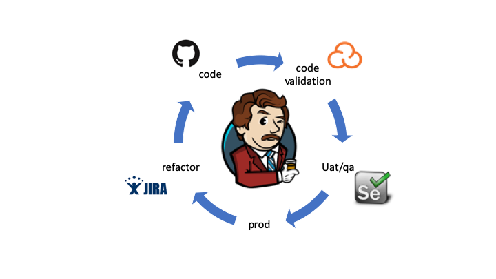

# DevOps
## Background
This is part of a long standing set of projects that are largely run out of my $HOUSE. It is called $HOUSE because over the last several years I have been in various locations. From DC to Boston, from Boston to San Francisco and Silicon Valley and from Silicon Valley to Tokyo, Japan.

## Flow Man, Flow


## Environment
Largely Linux, however these Linux machines run on one of two hosts now. One is OpenIndiana Hipster, the other is FreeBSD-12.0-
current. Why you might ask? Well look at scoday.tokyo for more information, but to make a long story short for the ZFS file system. Why not in the CloudZ you might think? Well, I run two laptops (reads efficient and with battery backup), on has 8GB RAM the other has ~11GB RAM and between them I have built a number of VMs. All for the cost of, well, the cost to power a laptop which isn't much. I already "need" the high speed to do work (in the clouds) so why not run my own cloud for about nothing relatively speaking. 

## Files
There are a number of files in here from Dockerfiles to bind configs, to whatever. The list changes daily so just browse.

### Bind
Bind contains some basic bind things to get you started. The goal here is to make things like automation a bit less painful by having forward and reverse dns on a domain like myhouse.local. 

## Docker
Some things and stuff

### Docker's Hanging Chads (Dangling Images)

So you built an image and you have a bunch of these <none> <none> imgaes, to get rid of the none docker images: 
```
$ docker rmi $(docker images --filter "dangling=true" -q --no-trunc)
``` 
